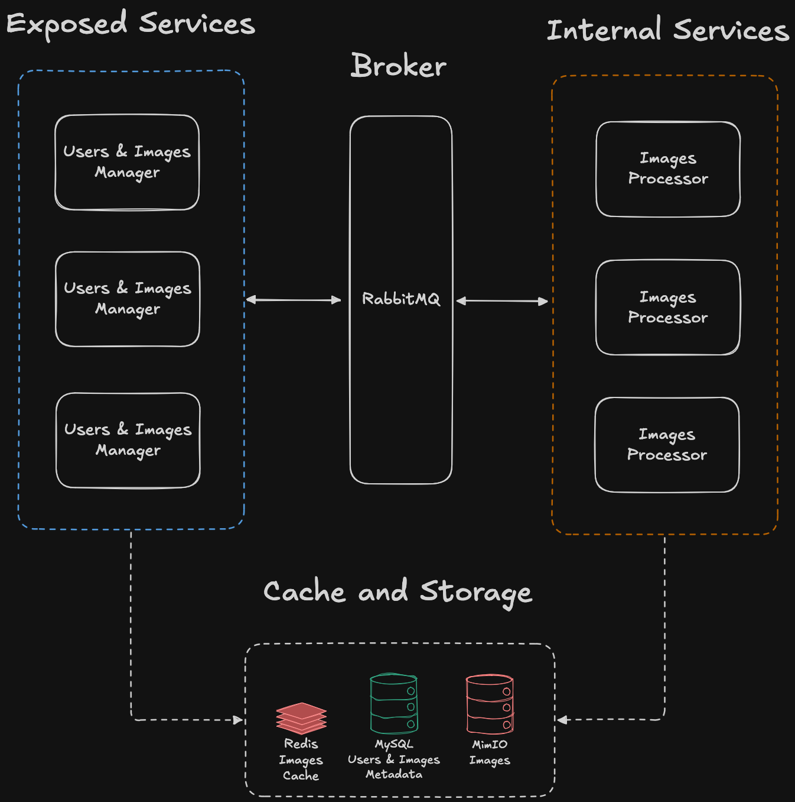

# imedit

A distributed system for image manipulation. Supports transformations such as cropping, resizing, rotating and filtering (sepia and gray scale filters).

## Overview

The system is composed of two services: **manager** and **processor**. Due to their stateless nature, both can be deployed with multiple replicas. The **manager** serves as the entry point for user registration, login, and various operations related to image storage and transformations. Each user can upload, download and transform images. Transformation requests are propagated through an event broker - **RabbitMQ** - and then received by **processor** services responsible for executing those operations.

WebSocket connections are used for notifying users upon transformations state, i.e., if they succeeded as expected or something went wrong.

Regarding caching and storage, [Redis](https://redis.io/) tracks recently accessed images and their associated metadata (when requested). [MinIO](https://www.min.io/) blob storage (similar to [Amazon S3](https://aws.amazon.com/s3/)) holds images along with the metadata and [MySQL](https://www.mysql.com/) manages registered users and maintains a list of uploaded images per user,to improve performance when users request multiple images in a single operation.

